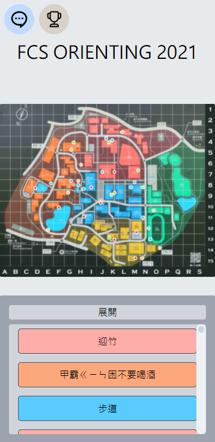
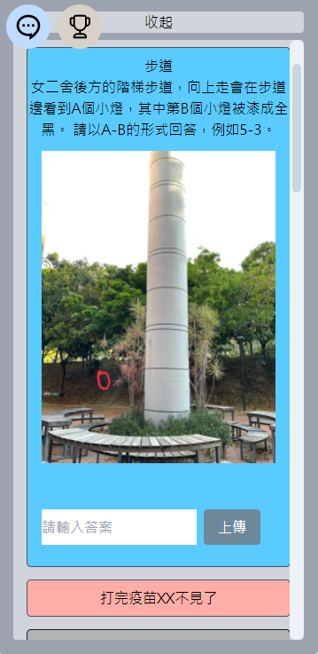
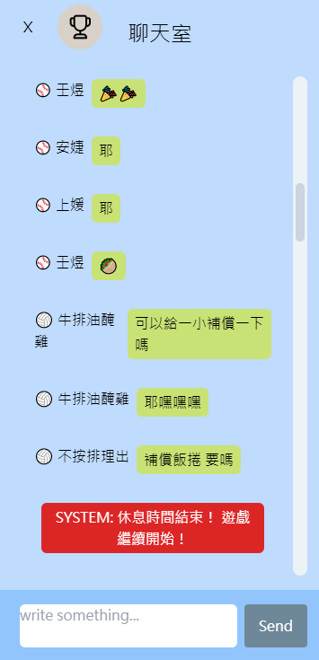

# fcs_orient_2021

a realtime app for fcs orienteering with chat.

## How to deploy with docker:

build client in ./client if you need:

```bash
npm run build
```

1. Download docker and docker-compose
2. Go to the root folder and run:

```bash
sudo docker-compose up -d
```
3. Initialize and import data to db with "mongo_import.sh" in ./dataset:

```bash
./dataset/mongo_import.sh 27018
```
4. That's all it!

## How to Play:
* Each member has an unique account! (login through QR code: http://${url}/login/${uid})
* Find the location of the picture in the card to be able to answer the question!
* Correctly answering a question will earn your team points and unlock new cards!
* The scoreboard will be locked at the second half of the game, and the scores earned by each team be revealed one by one in the end.
* Feel free to chat in the chatroom! 
* Pay attention to announcements! There may be clues inside!

## Screenshots:
* Main Page


* Question Cards


* Chatroom

